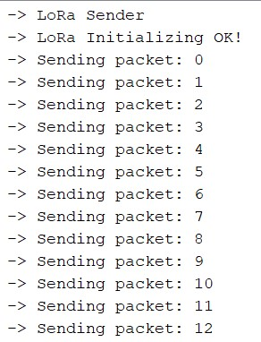
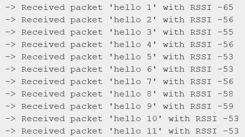

# LoRa Point to Point

## Topology

## Requirements

* 2x [Cosmic LoRa Aurora v1 or v2](https://www.tokopedia.com/cosmic-iot/lora-esp32-esp-32-arduino-915-mhz-915mhz-antenna-lipo-charger)
* 2x Micro USB Type B Cable for Aurora v1 or USB Type C for Aurora V2
* [Arduino IDE](https://www.arduino.cc/en/software)

## Prerequisite

* [Serial chip CH340 driver](https://sparks.gogo.co.nz/ch340.html)
* [ESP32 chip driver](https://randomnerdtutorials.com/installing-the-esp32-board-in-arduino-ide-windows-instructions/)

## Source Codes

Aurora V1
* [Transmitter](examples/aurora-v1-lora-p2p-transmitter/aurora-v1-lora-p2p-transmitter.ino)
* [Receiver](examples/aurora-v1-lora-p2p-receiver/aurora-v1-lora-p2p-receiver.ino)

Aurora V2
* [Transmitter](examples/aurora-v2-lora-p2p-transmitter/aurora-v2-lora-p2p-transmitter.ino)
* [Receiver](examples/aurora-v2-lora-p2p-receiver/aurora-v2-lora-p2p-receiver.ino)

## Step by Step

1. Plug the Cosmic LoRa Aurora boards to your Laptop. Transmitter and Receiver can be either LoRa Aurora V1 or V2. The configuration can be mixed among those. 
2. COM Port should be activated. ([If not? Install driver](https://sparks.gogo.co.nz/ch340.html)).
3. Setup in Arduino IDE : Pick the appropriate board : Tools -> Board -> ESP32 Arduino -> ESP32 Dev Module ([If not selectable? Install the Board](https://randomnerdtutorials.com/installing-the-esp32-board-in-arduino-ide-windows-instructions/))
4. Setup Transmitter
   * Load Code to Arduino IDE, Aurora V1 load [Transmitter code](examples/aurora-v1-lora-p2p-sender/aurora-v1-lora-p2p-transmitter.ino) while Aurora V2 load [Transmitter code](examples/aurora-v2-lora-p2p-sender/aurora-v2-lora-p2p-transmitter.ino).
   * Click Verify then Click Upload to Board.
   * Open Serial Monitor of Arduino IDE. Set the Baud Rate as stated in Serial.begin of the transmitter code. Some debug info should be appeared stated it transmits some data.
   * 
5. Setup Receiver
   * Load Code to Arduino IDE, Aurora V1 load [Receiver code](examples/aurora-v1-lora-p2p-receiver/aurora-v1-lora-p2p-receiver.ino) while Aurora V2 load [Receiver code](examples/aurora-v2-lora-p2p-receiver/aurora-v2-lora-p2p-receiver.ino).
   * Open Serial Monitor of Arduino IDE. Set the Baud Rate as stated in Serial.begin of the receiver code. Some debug info should be appeared stated it recieves some data.
   * 
6. YEEAAYY Congrattzz!! You are sending LoRa Point-to-Point.

## Contact Us

Any issue of the tutorial or need IoT solutions? Please [contact us](https://wa.me/6282117421332)
