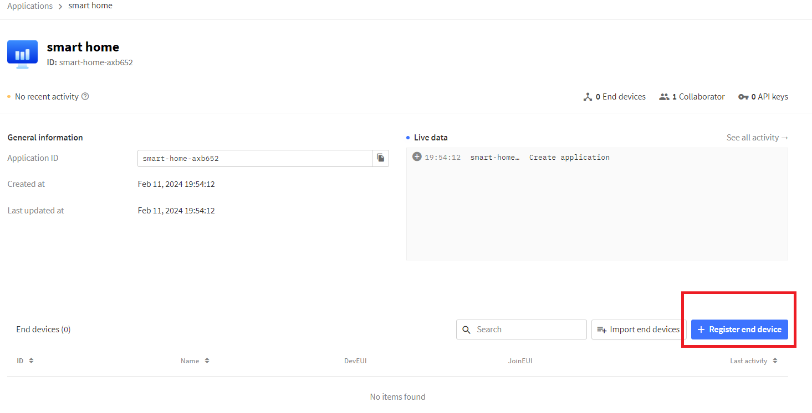

# LoRaWAN The Things Network

This tutorial provides you an example of using [Cosmic LoRa Aurora](https://www.tokopedia.com/cosmic-iot/lora-aurora-esp32-esp-32-arduino-915-mhz-915mhz-sma-4-8dbi-8ba58) to send data to The Things Network.

## Topology

## Requirements

* 1 pc [Cosmic LoRa Aurora](https://www.tokopedia.com/cosmic-iot/lora-aurora-esp32-esp-32-arduino-915-mhz-915mhz-sma-4-8dbi-8ba58)
* 1 pc USB Type C Cable for Aurora V2 or 1x Micro USB Type B Cable for Aurora V1
* 1 pc [LoRaWAN Gateway RAK 7268](https://www.tokopedia.com/cosmic-iot/gateway-lora-lorawan-merk-rak-tipe-rak7268c-wisgate-edge-lite-2)
* [Arduino IDE](https://www.arduino.cc/en/software)

## Prerequisites

* Having an [The Things Network account](https://au1.cloud.thethings.network/)
* Connect the LoRaWAN Gateway RAK 7268 to the Things Network, you can follow [this tutorial](https://github.com/cosmic-id/lorawan-gateway).
* [Install CH340 Driver](https://sparks.gogo.co.nz/ch340.html)
* Install LoRaWAN Library
  1. [Download Library](/library/LoRaWAN.zip)
  2. Unzip the Library into one Folder
  3. Copy the one folder into your Arduino -> libraries
  4. Confirm whether the library is properly installed by opening the Arduino IDE. Check if File -> Examples -> Antares LoRaWAN is exist.

## Source Codes

> make sure you use the appropiate code. please double check your cosmic board version.

* [Aurora V1](examples/aurora-v1-lorawan-generic-send-class-C-ABP/aurora-v1-lorawan-generic-send-class-C-ABP.ino)
* [Aurora V2](examples/aurora-v2-lorawan-generic-send-class-C-ABP/aurora-v2-lorawan-generic-send-class-C-ABP.ino)
## Step by Step

### Register the End Device to The Things Network

1. Login to your [TTN account](https://au1.cloud.thethings.network/).
2. Create an Application in the TTN. 
  * 
  * 
3. Register End Device. This step is to register your LoRa Aurora to TTN.
  * 
  * 
  * 
4. End Device is Registered. 

### Program the End Device

1. Plug the Cosmic LoRa Aurora boards to your Laptop.
2. COM Port should be activated. (If not activated? [Install CH340 driver](https://sparks.gogo.co.nz/ch340.html)).
3. Setup in Arduino IDE : Pick the appropriate board : Tools &#8594; Board &#8594; ESP32 (If not listed? [Install ESP32 Board](https://randomnerdtutorials.com/installing-the-esp32-board-in-arduino-ide-windows-instructions/))
4. Load [LoRaWAN code](#source-codes) to Arduino IDE.
6. Modify the code using your registered TTN parameters of **Device Address, Application Session Key & Network Session Key.** 
7. Click Verify then Click Upload to Board. (Error compile? [Make sure do the Prerequisites](#prerequisite))
8. Open Serial Monitor of Arduino IDE. Set the Baud Rate as stated in Serial.begin of the code. Some debug info should be appeared stated it transmits some data to TTN. 
9. Check your TTN Console. Some data must be shown. YEEAAYY Congrattzz!! You are successfully sending LoRaWAN to TTN.

