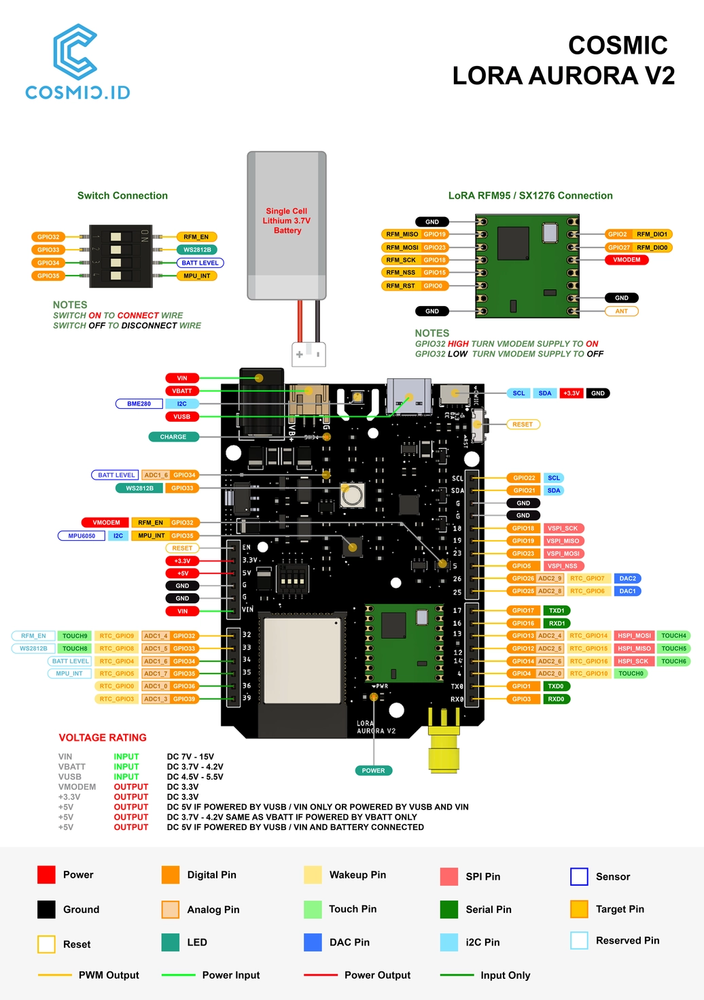

# Cosmic LoRa Aurora

## Overview

Cosmic LoRa Aurora is an High-End Development Board that will fasten your time to market or ease your DIY project. It is armed with an ESP32 which makes it an AI-ready device and so recommended as an Edge Device. The Cosmic LoRa Aurora dev board has three power source inputs -USB, LiPo Battery, DC Jack- which can run those options simultaneously. The board features smart power switching, which can automatically prioritize either USB, LiPo and DC Jack. So you can charge the LiPo while running the board thru USB or Solar-powered DC Jack. By default, the ESP32 has been included with WiFi and Bluetooth Low Energy. That connectivity even extended with the presence of the LoRa(WAN) module of [RFM95W](https://cdn.sparkfun.com/assets/learn_tutorials/8/0/4/RFM95_96_97_98W.pdf). LoRa(WAN) has a good reputation for low power consumption, complementing the sleep mode of ESP32, making this board even more useful in a low power ecosystem. In conclusion, this is the most go-to board for your IoT applications.

> Cosmic are universe so our products name are based on universe.

[Dokumentasi dalam bahasa Indonesia](id/)

## Table of Content

* [Technical Spesification](#technical-spesification)
* [Documentation](#documentation)
  * [Pinout Diagram](#pinout-diagram)
  * [LoRaWAN Chip Interfacing](#lorawan-chip-interfacing)
  * [Examples](#examples)
* [FAQ](#FAQ)

## Technical Spesification

| Feature                 |                    Value                |  
| ----------------------- | --------------------------------------- |
| Microcontroller         |                    ESP32          |
| Bootloader              |                                 |
| Clock Speed             |                     MHz                |
| DC Jack Voltage Input   |                     V               |
| USB Voltage Input       |                     V            |
| Battery Voltage Input   |                     V            |
| Dig. Input Voltage      |                     V                |
| Dig. Output Voltage     |                     V                |
| Analog Input Voltage    |                     V                |
| Analog Digital Converter Resolution     |     bit               |
| Max Output Current      |                     mA               |
| Charging Rate           |                     mA               |
| LoRa(WAN) Chip          |                    RFM95W               |
| LoRa(WAN) Base Freq     |                    915 MHz              |
| LoRa(WAN) Freq Range    |                    902-928 MHz          |
| Antenna Impedance       |                    50 Ohm               |
| Available I/O           |                     |
| Length                  |                    mm              |
| Width                   |                    mm              |
| Weight                  |                  g                  |

## Documentation

### Pinout Diagram

> Click image for higher resolution

### LoRa(WAN) Chip Interfacing

| Cosmic LoRa Aurora   | RFM95W |  
|----------------------|------- |
| 23                   | MOSI   |
| 19                   | MISO   |
| 18                   | SCK    |
| 2                    | NSS    |
| 13                   | RST    |
| 14                   | DIO0   |
| 12                   | DIO1   |
| 32                   | ENABLE  |

### Examples

* [LoRa Point-to-Point](LoRa-P2P.md)
* [LoRaWAN ANTARES](LoRaWAN-ANTARES.md)

## FAQ

On-going
